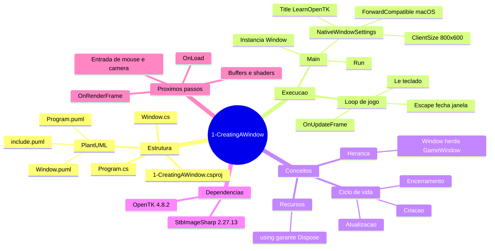

# Explicação - 1-CreatingAWindow

Fonte: <https://github.com/opentk/LearnOpenTK/tree/master/Chapter1/1-CreatingAWindow>  

## Visão geral

Este workspace é um exemplo mínimo com OpenTK para criar uma janela e iniciar o loop principal de uma aplicação gráfica.

Arquivos centrais do projeto:

- Program.cs  
- Window.cs  
- 1-CreatingAWindow.csproj  
- 1-CreatingAWindow.sln  

## Fluxo de execução

- A aplicação inicia em Main, em Program.cs:8
- São definidos os parâmetros da janela em Program.cs:10:
  - tamanho 800x600
  - título LearnOpenTK - Creating a Window
  - flag ForwardCompatible para macOS em Program.cs:16
- A classe Window é instanciada em Program.cs:20
- O método Run inicia o loop da aplicação em Program.cs:22
- A cada frame, OnUpdateFrame roda em Window.cs:17
- Se a tecla Escape estiver pressionada, a janela fecha em Window.cs:20

## Componentes principais

### Program

Responsável por configurar e iniciar a janela.
Usa bloco using para descarte correto de recursos ao encerrar.  
Referência: Program.cs

### Window

Classe que herda de GameWindow.  
Implementa lógica por frame no método OnUpdateFrame.  
Nessa classe, trata apenas entrada de teclado para fechar a janela.  
Referência: Window.cs

### Projeto .NET

Framework alvo: net9.0 em 1-CreatingAWindow.csproj:6  
Dependências: OpenTK 4.8.2 em 1-CreatingAWindow.csproj:10 e StbImageSharp 2.27.13 em 1-CreatingAWindow.csproj:11  
Referência: 1-CreatingAWindow.csproj  

### Mapa mental

## Próximos passos de estudo

- Implementar OnLoad para inicialização de recursos gráficos.
- Implementar OnRenderFrame para desenhar na tela.
- Estudar VAO, VBO, EBO e shaders.
- Evoluir entrada de teclado e mouse para câmera e navegação.
