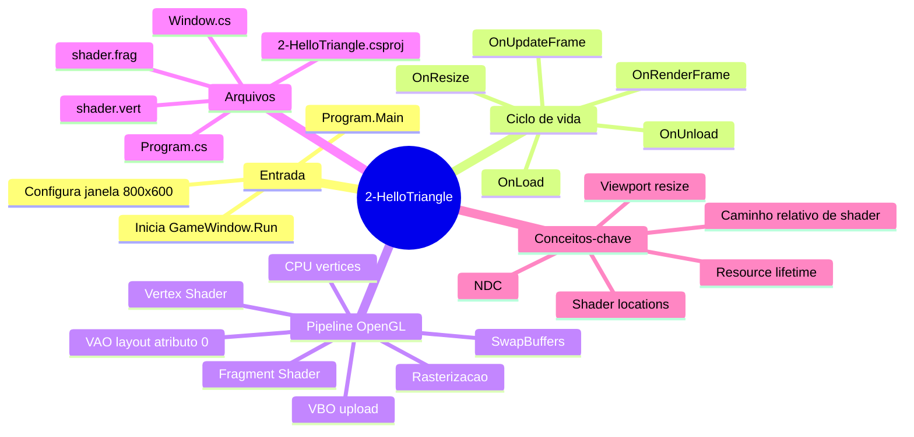

# Explicação - 2-HelloTriangle

Fonte: <https://github.com/opentk/LearnOpenTK/tree/master/Chapter1/2-HelloTriangle>  

## Visão geral

Este workspace é um exemplo didático de OpenTK + OpenGL para renderizar um triângulo, com foco no ciclo básico de uma aplicação gráfica em tempo real.  

### Estrutura funcional

- Entrada da aplicação em Program.cs:9: cria as configurações da janela e inicia o loop principal.
- Lógica da janela/renderização em Window.cs:10: inicializa recursos OpenGL, desenha por frame, trata teclado e resize, e libera recursos.
- Shaders GLSL em shader.vert:5 e shader.frag:1: definem posição dos vértices e cor final dos pixels.
- Configuração do projeto em 2-HelloTriangle.csproj:1: alvo .NET 9, pacotes OpenTK/StbImageSharp, cópia dos shaders para a pasta de saída.
- Diagramas simples de apoio em Program.puml:1 e Window.puml:1.

### Tecnologias e dependências

- .NET 9 em 2-HelloTriangle.csproj:6.
- OpenTK 4.8.2 em 2-HelloTriangle.csproj:14.
- StbImageSharp em 2-HelloTriangle.csproj:15 (não é essencial para este triângulo específico, mas costuma aparecer).
- Referência a um projeto Common (biblioteca auxiliar com classe de shader) em 2-HelloTriangle.csproj:19.

## Fluxo de execução

### Fluxo macro (do start ao frame)

- O método Main cria NativeWindowSettings (800x600, título e compatibilidade com macOS) em Program.cs:11.
- Instancia Window e chama Run em Program.cs:19.
- O GameWindow dispara callbacks de ciclo de vida:
  - OnLoad uma vez, para setup
  - OnUpdateFrame repetidamente, para lógica/entrada
  - OnRenderFrame repetidamente, para desenho
  - OnResize quando dimensão muda
  - OnUnload ao encerrar

#### Fluxo detalhado por callback
  
- OnLoad em Window.cs:45:
  - Define a cor de limpeza (fundo).
  - Cria VBO, faz bind e envia vértices via BufferData em Window.cs:82.
  - Cria VAO e descreve layout do atributo de posição via VertexAttribPointer em Window.cs:106.
  - Cria/ativa shader com arquivos GLSL em Window.cs:117.
- OnRenderFrame em Window.cs:127:
  - Limpa o buffer de cor.
  - Ativa shader e VAO.
  - Desenha 3 vértices como triângulo com DrawArrays em Window.cs:156.
  - Faz SwapBuffers.
- OnUpdateFrame em Window.cs:167:
  - Se ESC estiver pressionado, fecha a janela.
- OnResize em Window.cs:179:
  - Atualiza viewport para ajustar com o novo tamanho da janela.
- OnUnload em Window.cs:201:
  - Desvincula e deleta recursos OpenGL (VBO, VAO, programa).

## Explicação detalhada das partes críticas

### Parte crítica A: Pipeline de dados CPU → GPU

- Vetores de vértice no CPU: array _vertices em Window.cs:16.
- Upload para GPU: GL.BufferData em Window.cs:82.
- Estrutura dos atributos: GL.VertexAttribPointer em Window.cs:106 com:
  - location = 0
  - 3 floats por vértice
  - stride = 3 * sizeof(float)
  - offset = 0
- Habilitação do atributo: GL.EnableVertexAttribArray(0) em Window.cs:109.

Por que é crítico:  
Sem esse alinhamento entre layout C# e layout GLSL, o shader recebe dados incorretos e nada aparece (ou aparece quebrado).

### Parte crítica B: Contrato entre vertex shader e VAO

- No GLSL, atributo de entrada está em location 0: shader.vert:28.
- No C#, o VAO aponta o atributo 0 para o VBO: Window.cs:106.

Por que é crítico:  
Location do shader e índice do VertexAttribPointer precisam coincidir exatamente.

### Parte crítica C: Transformação final de posição

- Vertex shader define gl_Position em shader.vert:40.
- Como o exemplo já usa coordenadas em NDC, não há matriz de transformação ainda.
- NDC esperado: x, y, z no intervalo aproximado de -1 a 1.

Por que é crítico:  
Se gl_Position for inválido, o triângulo fica fora do volume visível.

### Parte crítica D: Cor final por fragment shader

- Fragment shader escreve outputColor em shader.frag:3.
- Cor fixa amarela em shader.frag:7.

Por que é crítico:  
Sem saída de cor válida no fragment shader, o rasterizador não gera o resultado visual esperado.

### Parte crítica E: Recursos externos (arquivos shader)

- Carga dos shaders por caminho relativo em Window.cs:117.
- Garantia de cópia para output em 2-HelloTriangle.csproj:10, 2-HelloTriangle.csproj:24 e 2-HelloTriangle.csproj:27.

Por que é crítico:  
Se os arquivos não estiverem no diretório de execução, ocorre erro de leitura de arquivo ao iniciar.

### Parte crítica F: Compatibilidade macOS

- Uso de ForwardCompatible em Program.cs:16.

Por que é crítico:  
Em macOS, isso evita incompatibilidades de contexto OpenGL em várias combinações de driver.

## Mapa mental (mindmap)

## Dúvidas comuns

- Por que não aparece nada na tela?
Causas típicas: erro ao carregar shader, mismatch de location, viewport errado, ou DrawArrays com contagem/layout inconsistente.

- Por que usar VAO se já tenho VBO?
VBO guarda dados; VAO guarda a interpretação desses dados para os atributos do shader.

- Por que atualizar viewport no resize?
Sem isso, a área de desenho OpenGL não acompanha o tamanho da janela.

- Por que chamar SwapBuffers?
A janela é double-buffered; sem swap você desenha no buffer de trás e não apresenta no monitor.

- Por que o triângulo está amarelo?
Porque o fragment shader define cor fixa vec4(1,1,0,1).

## Próximos passos de estudo

- Introduzir uniforms para mover/rotacionar o triângulo no vertex shader.
- Trocar cor fixa por cor por vértice (atributo adicional no VBO + interpolação no shader).
- Adicionar EBO/índices para aprender desenho indexado.
- Implementar matriz de transformação Model/View/Projection.
- Carregar textura e coordenadas UV.
- Experimentar animação baseada em tempo no OnUpdateFrame.
- Comparar os diagramas em Program.puml:1 e Window.puml:1 com a evolução do código para documentar arquitetura crescente.
